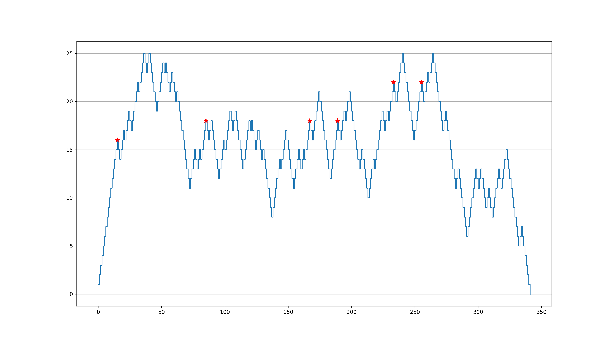

# Maze Generator and Path Finder

A visual and interactive exploration of maze generation and pathfinding!
This project creates mazes, solves them using **Dijkstra’s algorithm (with a heuristic)**, and visualizes everything — from paths to recursion behavior.

---

## Motivation

This project began as a personal learning adventure a few years ago. I was looking for a fun **puzzle generator** for my little **nephews and niece**, while also learning Python and algorithms.

I was inspired by **Dan Shiffman’s “Coding Train”** and his cool demonstrations of the **A*** pathfinding algorithm with JS & Processing.
That inspiration led me to build something of my own — a maze generator and solver that’s part art, part algorithm, and part puzzle. 

---

## Features

* Generate **perfect mazes** using the *recursive backtracker (“digger”)* algorithm
* Or build **random mazes** using a specified wall probability
* Find the **shortest path** (Dijkstra / A*) between start and finish
* Optionally **recursively find all possible paths**
* Visualize recursion depth and algorithmic behavior
* Save results as clean, high-resolution PDFs

---

## Usage

### Basic command

```bash
python maze.py [OPTIONS]
```

### Command-line options

| Option             | Description                                                                                                                                                                   | Default | Example                       |
| ------------------ | ----------------------------------------------------------------------------------------------------------------------------------------------------------------------------- | ------- | ----------------------------- |
| `--size m,n`       | Maze dimensions (width,height).                                                                                                                                               | `25,35` | `--size 40,40`                |
| `--prob P`         | **Wall probability** — the probability that a cell will be a wall in random maze mode. If `P` is too high, the maze may become unsolvable and require multiple regenerations. | `0.35`  | `--prob 0.2`                  |
| `--use-random`     | Use the **random wall-based maze** instead of the digger (recursive backtracker).                                                                                             | *off*   | `--use-random`                |
| `--find-all`       | Find **all possible paths** recursively (can be slow).                                                                                                                        | *off*   | `--find-all`                  |
| `--draw-all-paths` | If combined with `--find-all`, draw and save **all discovered paths**.                                                                                                        | *off*   | `--find-all --draw-all-paths` |

---

## Example Outputs

### 1. **Perfect Maze (Digger Mode)**

```bash
python maze.py
```

* Uses the recursive backtracker (“digger”) algorithm.
* Always guarantees **exactly one** path between any two points.
* Recursion completes quickly and predictably.

**Outputs:**

* `maze.png`
* `shortestpath.png`

| Maze                     | Shortest Path                             |
| ------------------------ | ----------------------------------------- |
|  |  |

---

### 2. **Random Maze**

```bash
python maze.py --use-random --prob 0.3
```

* Each cell independently becomes a wall with probability `p`.
* Higher `p` → denser maze, possibly requiring multiple regenerations to ensure a valid path exists.
* Can contain **multiple possible paths** and **loops**.

**Outputs:**

* `maze.png`
* `shortestpath.png`

| Random Maze                            | Path Found                             |
| -------------------------------------- | -------------------------------------- |
|  |  |

---

### 3. **Recursion and Path Exploration**

```bash
python maze.py --find-all
```

* Explores **all possible paths** recursively.
* Generates recursion analysis graphs.
* On random mazes, this can take a long time — recursion grows exponentially with density and size.
* On digger mazes, there’s **only one path**, so recursion completes almost instantly.

**Outputs:**

* `maze.png`
* `shortestpath.png`
* `recursion.png`

| Recursion Depth Graph - Shows 6 paths were found                   |
| ---------------------------------------- |
|  |

---

### 4. **Draw All Paths**

```bash
python maze.py --use-random --find-all --draw-all-paths
```

* Visualizes *all* discovered paths in semi-transparent colors.
* Especially beautiful on small random mazes with multiple solutions.
* `--use-random` must be used if you want to give yourself a chance of creating more than 1 path.
* `'--find-all` prints out a small report on recursion outcomes

**Outputs:**

* `maze.png`
* `shortestpath.png`
* `recursion.png`
* `all_paths.png`

| All Paths Visualization            |
| ---------------------------------- |
|  |

| Recursion Output            |
| ---------------------------------- |
|
```
Starting recursion ...
        Paths found: 14272
Finished in 12 second(s)

Paths to destination: 14272
Cul-de-sacs or loops: 650017
Length of shortest path: 30 steps
Length of longest path: 100 steps
The algorithm made 2321703 recursive call(s) and 2321703 backtrack(s)
Saved recursion stats.
```
|
---

## Output Summary

| File                   | Description                                      |
| ---------------------- | ------------------------------------------------ |
| **`maze.png`**         | Maze layout (walls in orange, start/end in red). |
| **`shortestpath.png`** | Maze with shortest path overlaid in blue.        |
| **`recursion.png`**    | Recursion depth vs. iteration graph.             |
| **`all_paths.png`**    | All discovered paths (semi-transparent brown).   |

---

## Algorithmic Details

### Maze Generation Modes

#### 1. Recursive Backtracker (Default)

* Also called the *digger algorithm*.
* Produces a **perfect maze** — there’s one and only one path between any two points.
* No loops or dead ends.
* Fast and guaranteed solvable.

#### 2. Random Maze (`--use-random`)

* Each cell independently becomes a wall with probability `p` (`--prob`).
* If `p` is too high, the maze can become **too dense**, requiring multiple regenerations until a solvable configuration appears.
* Random mazes can have **multiple paths**, **loops**, and **dead ends**.
* Recursive pathfinding (`--find-all`) can be computationally expensive on these mazes.

---

### Pathfinding Algorithm

* Implements **Dijkstra’s algorithm** with a **Euclidean heuristic** (making it behave like A*).
* Uses Python’s built-in `heapq` for efficient priority queuing.
* Tracks visited nodes, cost distances, and reconstructs the shortest route once the goal is reached.

---

### Recursive Path Search (`--find-all`)

* Explores *every possible route* from start to finish using **depth-first recursion**.
* Tracks:

  * Recursion depth
  * Backtrack count
  * Cul-de-sacs and branching points
* Generates a `recursion.png` graph showing recursion growth and plateaus.
* When combined with `--draw-all-paths`, produces `all_paths.png` — a visual map of all discovered routes.

---

## Tips

* Start small for experimentation:

  ```bash
  python maze.py --size 10,10
  ```
* Adjust wall probability for challenge:

  ```bash
  python maze.py --use-random --prob 0.15
  ```
* For recursion analysis only:

  ```bash
  python maze.py --find-all
  ```
* Combine everything (but bring patience):

  ```bash
  python maze.py --use-random --prob 0.25 --find-all --draw-all-paths
  ```

---

## Acknowledgements

* Inspired by [**Dan Shiffman’s “The Coding Train”**](https://thecodingtrain.com/) and his approachable visualizations of A* and other algorithms.
* Created while learning Python, algorithms, and `matplotlib` — and while making something fun for my little **nephews and niece** who love mazes and puzzles.
* I am a recreational coder which means the code is probably not optimized so feel free to use it as is or take it to the next level.

---

## Project Info

| Field | Value |
|-------|--------|
| **Author** | Aniruddha Nagaraj |
| **License** | MIT |
| **Python Version** | 3.8+ |
| **Dependencies** | numpy, matplotlib |


---

## Repository Structure
```
├── .gitignore
├── images
│   ├── all_paths.png
│   ├── maze.png
│   ├── random_maze.png
│   ├── random_path.png
│   ├── recursion.png
│   └── shortestpath.png
├── LICENSE
├── maze.py
└── README.md
```